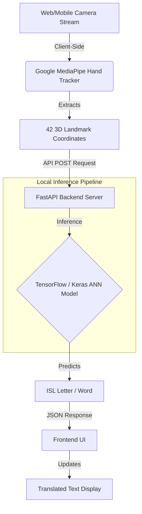

<h1 align="center">SignLink AI</h1>

<h3 align="center">Where Accessibility Meets Practicality</h3>

<p align="center">
  <strong>Real-time Indian Sign Language (ISL) to Text Translator</strong><br>
  An entirely private, web-based, AI-powered platform for instant communication.
</p>

---

## 📖 Overview

SignLink AI bridges the communication gap by translating Indian Sign Language (ISL) gestures into readable text instantly using robust, optimized Machine Learning directly inside your browser. Designed for schools, workplaces, public services, and daily interactions, it enables an interpreter-free communication experience without the need for specialized hardware.

## ✨ Key Features

- **⚡ Real-Time Speed (0ms Network Latency)**: By leveraging highly optimized localized inference, translations happen instantaneously directly on your device. Zero frames are sent to the cloud.
- **🧠 42 Point Landmarks**: Utilizes advanced Google MediaPipe integration to map and track 42 high-fidelity 3D structural coordinates across both hands simultaneously.
- **🔒 100% Private & Secure**: No video ever leaves your computer or mobile device.
- **🌐 Zero Installation**: The platform functions entirely within modern web browsers, achieving inclusive scale without demanding software downloads.

## ⚙️ Working Mechanism

1. **Live Input Capture**: Captures live hand gestures in real-time through standard web or mobile cameras without requiring any specialized hardware.
2. **Precision Hand Mapping**: Utilizes Google MediaPipe to instantly detect hands and extract 42 precise 3D structural landmark coordinates.
3. **Neural Network Processing**: Feeds the extracted spatial data into a custom-trained Deep Learning Artificial Neural Network (ANN) built exclusively for Indian Sign Language datasets.
4. **Instant Translation**: Instantly processes and translates the recognized gestures into accurate, readable ISL letters and essential phrases.
5. **Real-Time Display**: Displays the final translated text directly on the user's screen in real-time.

## 🏗️ Architecture Diagram



## 💻 Technology Stack

- **Frontend Core**: HTML5, Vanilla JavaScript, CSS3 (Modern Glassmorphism & Animations)
- **Computer Vision**: Google MediaPipe (Hand Landmarker)
- **Machine Learning**: TensorFlow / Keras (Custom ISL ANN Model), Scikit-Learn
- **Backend API**: Python, FastAPI
- **Web Server**: Uvicorn

## 🚀 Getting Started

To run the platform locally on your own machine:

### 1. Prerequisites
Ensure you have Python 3.8+ installed.

```bash
pip install fastapi uvicorn mediapipe opencv-python tensorflow numpy joblib python-multipart
```

### 2. File Structure Requirement
Ensure you have the required trained `.h5` model and `.pkl` scaler files inside your `models/` directory for the predictor to load successfully.

### 3. Run the Backend API
Start the FastAPI server which serves the local translation inference:
```bash
uvicorn main:app --reload --port 8000
```

### 4. Launch the Frontend
Open `index.html` directly in your web browser, or serve the directory using a lightweight web server:
```bash
python -m http.server 3000
```
Navigate to `http://localhost:3000` to access the application.

## 🎨 Screenshots & UI

*(Insert your hero images and platform screenshots here)*

- **Home Page**: `./hands2.png` *(or equivalent screenshot)*
- **About Us**: `./about_us.png`
- **Guides**: `./how_it_works.png`

---
*Built to make the world more accessible.*
